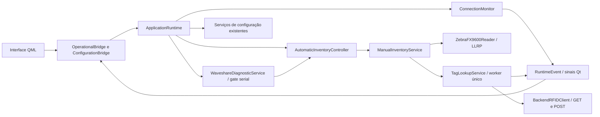

# RF018 — Relatório da integração operacional Qt

Data: 2026-10-09. Integração operacional implementada e validada com simuladores.
A migração do código foi finalizada após autorização explícita do usuário para
substituir Tkinter antes da homologação. A homologação física continua pendente;
nenhum resultado de teste simulado é declarado como teste no equipamento.

## Etapas

| Etapa | Resultado |
|---|---|
| 1 — Composição | ApplicationRuntime sem Tkinter/widgets; início e encerramento controlados |
| 2 — Indicadores | Eventos do único monitor para RFID, Internet, Comandos, Sistema e Base de dados |
| 3 — Backend/tabela | Health, GET EPC e POST de passagem; tabela incremental e contador por sessão |
| 4 — Zebra | Mesmo reader LLRP compartilhado; Start/Stop, callbacks, falha e recuperação |
| 5 — Waveshare | Mesmo worker/gate serial; diagnóstico DI1–DI5 e CH1–CH8 com retorno confirmado |
| 6 — Operação | DI1/DI2, timer de 60 segundos, geração de ciclos e CH1/CH2/CH3 preservados |
| 7 — Simuladores | Fluxos completos e caminhos de falha testados, sem equipamento |
| 8 — Homologação física | Pendente; checklist criado; nenhum comando físico executado pelo agente |
| 9 — Substituição final | Autorizada pelo usuário; Qt oficial por padrão, composição/widgets Tkinter removidos |
| 10 — Windows | Bundle nativo construído; smoke test isolado de prévia/configuração aprovado; máquina limpa/hardware pendentes |

## Arquitetura e serviços reutilizados



ReaderConfigurationService, WaveshareConfigurationService,
StationConfigurationService e BackendConfigurationService permanecem responsáveis
por validação e persistência. O modo Qt operacional usa suas mesmas instâncias.
LLRP e Modbus continuam encapsulados nos adaptadores; os protocolos e endereços
não foram alterados. O runtime não realiza consulta SQLite ou Power Automate.

Modelos Qt recebem apenas resultados já processados. Sinais enfileirados entregam
os eventos à thread principal, conforme a
[documentação do QAbstractTableModel](https://doc.qt.io/qt-6.10/qabstracttablemodel.html#thread-safety).
Os slots usam snapshots locais, inclusive enquanto o controller aguarda LLRP.

## Arquivos criados

- `src/rfid_reader/runtime.py`
- `src/rfid_reader/ui/qt/operational.py`
- `src/rfid_reader/ui/qml/pages/DiagnosticPage.qml`
- `tests/unit/test_application_runtime.py`
- `tests/ui/fakes_operational.py`
- `tests/ui/test_qt_operational.py`
- `packaging/windows_entry.py`
- `tools/build_windows.py`
- `tools/verify_windows.py`
- `docs/validacao/RF018-homologacao-fisica.md`
- `docs/validacao/RF018-relatorio-operacional.md`

## Arquivos modificados

- `src/rfid_reader/cli.py` e `cli_qt.py`
- `src/rfid_reader/integrations/backend_client.py`
- `src/rfid_reader/services/automatic_inventory.py`, `backend.py`,
  `connection_monitor.py`, `manual_inventory.py`, `tag_lookup.py`, `waveshare_diagnostic.py`
- `src/rfid_reader/ui/__init__.py`, `ui/qt/application.py` e `ui/qt/configuration.py`
- `src/rfid_reader/ui/qml/Main.qml`, `pages/SettingsPage.qml`, `components/AppSidebar.qml`
- `tests/unit/test_cli.py`, `test_cli_qt.py`, `test_waveshare_connection_status.py`
- `tests/ui/test_qml_prototype.py` e `test_qt_configuration_isolation.py`
- `pyproject.toml`, `README.md`, `docs/adr/ADR-015-migracao-incremental-pyside6-qml.md`

## Arquivos removidos

- `src/rfid_reader/application.py`
- `src/rfid_reader/ui/main_window.py`, `pages.py`, `components.py`, `navigation.py`,
  `waveshare_diagnostic_page.py`
- `src/rfid_reader/ui/theme/__init__.py`, `styles.py`, `colors.py`, `typography.py`
- `tests/unit/test_main_window_lookup_summary.py`, `test_navigation.py`,
  `test_reader_settings_page.py`, `test_tag_lookup_table.py`, `test_waveshare_diagnostic_page.py`

Esses 15 arquivos eram exclusivos da composição e apresentação Tkinter. Os
serviços, adaptadores e testes de regras operacionais foram preservados. A
cobertura Qt existente substitui os testes de widgets retirados; controles
CH6–CH8 e a seleção da entrada oficial recebem verificação adicional.
O runtime perdeu suas filas e wrappers exclusivos da janela antiga.

Assets de branding permaneceram idênticos.
Arquivos gerados em `build/` e `dist/` estão ignorados pelo repositório.
Total acumulado desde o início desta implementação: 11 arquivos criados,
23 modificados e 15 removidos. Na substituição final: 18 modificados e
15 removidos; nenhum novo arquivo de produção nessa etapa.

## Verificações e cobertura

Baseline anterior à integração: 383 testes aprovados. Antes da substituição:
**410 testes executados,
410 aprovados e 0 reprovados**, em 84,71 segundos; 27 testes adicionados.
Ruff check e format check aprovados nos 150 arquivos; Mypy aprovado nos
59 arquivos de fonte. Build Windows e verificação do bundle atualizado
concluídos com código de saída 0. Nenhum teste físico foi executado.

Após a retirada do Tkinter: **377 testes executados, 377 aprovados e
0 reprovados**, em 98,14 segundos. Foram retirados 41 casos exclusivos da
apresentação Tkinter e adicionados 8 casos de entrada Qt. Testes de serviços,
protocolos e regras operacionais permaneceram, com cobertura de apresentação
pelos modelos, bridges e QML. Ruff check e format check aprovados nos 135
arquivos; Mypy aprovado nos 49 arquivos de fonte.

A instalação editável foi atualizada sem download de dependências. O bundle
final foi reconstruído com código 0 e verificado com código 0: prévia,
configuração isolada, `check-config`, recursos, branding e ausência de Tkinter.
Nenhum teste físico foi executado. Todas as verificações finais foram aprovadas.

Comandos executados com Python 3.12.10 nativo do Windows:

```powershell
.venv/Scripts/python.exe -m ruff check .
.venv/Scripts/python.exe -m ruff format --check .
.venv/Scripts/python.exe -m mypy src
.venv/Scripts/python.exe -m pytest -q
.venv/Scripts/python.exe tools/build_windows.py
.venv/Scripts/python.exe tools/verify_windows.py
```

O check Ruff final foi executado com `--no-cache`, após restrição de acesso
ao cache local; não houve supressão de regras ou alteração da configuração.

Os testes novos verificam:

- construção sem UI/hardware/workers, início, eventos, comandos e encerramento idempotente;
- ciclo completo DI1 → inventário → GET → POST → tabela/contador → DI2;
- projeção do resultado na thread Qt e controles QML reais com fakes;
- GET 404, GET/POST 500, timeout, EPC repetido e nova sessão;
- nenhum POST por renderização e nenhum retry de falha ambígua;
- POST tardio após Stop na mesma sessão e resposta antiga ignorada na nova sessão;
- limite de 60 segundos e timer antigo incapaz de interromper outro ciclo;
- perda e recuperação de Zebra/Backend, perda Waveshare e falha ao iniciar inventário;
- Base de dados indisponível/recuperada usando a mesma resposta health;
- diagnóstico manual e proteção de CH1–CH3 durante automático;
- fechamento durante leitura, GET ou POST; GET invalidado não inicia novo POST;
- falha de limpeza não deixa os outros workers vivos;
- I/O LLRP lento não bloqueia slots nem a entrega de eventos Qt;
- teste RFID reutiliza o reader, restaura/reconecta a configuração salva e
  recusa execução no automático; teste Waveshare reutiliza a sessão serial;
- argumentos da CLI impedem misturar operação, prévia e captura automática.

Os testes existentes continuam cobrindo os contratos HTTP, os adapters LLRP/
Modbus, validações, configurações, estados, timers e callbacks simulados.
Testes de hardware não foram executados.

## Empacotamento Windows

PyInstaller 6.22.3 e hooks 2026.8 geram `dist/DSV-RFID/DSV-RFID.exe` com Python,
DLLs, QML, componentes, SVG DSV e plugins Qt. Os hooks tratam as bibliotecas
Qt; os dados da aplicação acompanham o bundle conforme a
[documentação do PyInstaller](https://pyinstaller.org/en/stable/spec-files.html#adding-data-files).
A pasta completa deve acompanhar o executável. O `.env` real não foi empacotado.

O smoke test executa a prévia e a configuração local com cwd em
`build/rf018-distribution-smoke`, remove Python/venv do PATH e usa configuração
fictícia. Verifica PNGs, recursos, DLL Python, plugin `qwindows.dll`, igualdade
do logotipo e ausência de alteração do arquivo fictício. As capturas ficam
em `start.png` e `settings.png` nessa pasta. A execução operacional com drivers
e equipamentos reais permanece sujeita à homologação.

O bundle foi reconstruído após a última alteração operacional e verificado
novamente. Prévia e configuração encerraram com código 0, sem mensagens de erro;
recursos e capturas foram confirmados, sem alteração da configuração fictícia.
O executável final usa a CLI oficial: sem opções inicia Qt operacional;
`--preview` é exigido para a prévia. O build exclui Tkinter, e o verificador
confirma a ausência do toolkit e executa `check-config --env-file` com dados
fictícios. PySide6 é dependência de produção, sem extra `qt` necessário.

## Pendências e limites

1. Executar o [checklist físico](RF018-homologacao-fisica.md) com FX9600,
   Waveshare, sensores/relés e Backend de testes, após confirmação do ambiente.
2. Conferir a divergência histórica de RF012: o arquivo descreve 30 segundos
   e CH3 para ambos os feixes interrompidos; o controller atual e RF018 usam
   60 segundos e CH3 para indisponibilidade. Esta migração preservou o código atual.
3. A substituição final foi autorizada e implementada antes da homologação.
   A entrada padrão abre Qt operacional; `--preview` e `--configure` abrem
   sem hardware. `--operate` permanece aceito. `rfid-reader show` também abre Qt.
4. Repetir a validação do bundle em outro Windows sem Python, com drivers,
   permissões e infraestrutura de destino. Não foi criado instalador assinado.
5. Base de dados é indicador observacional; a aptidão preserva Sistema/`status`
   conforme ADR-013. O POST já enviado não pode ser desfeito por Stop/fechamento.

Git não está disponível no PATH nem no caminho usual verificado. A revisão
compara um snapshot local anterior com os arquivos atuais e inspeciona o código;
os diffs ficam em `build/rf018-review.diff` (integração) e
`build/rf018-final-review.diff` (substituição). O snapshot pré-substituição está
em `build/rf018-before-final`; `build/rf018-complete-review.diff` registra o
diff acumulado revisado. Nenhum commit, reset ou mudança na base de
configuração real foi realizado. A migração do software está implementada;
o aceite físico do RF018 permanece pendente.
